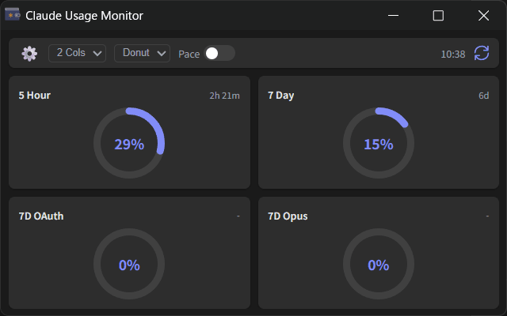
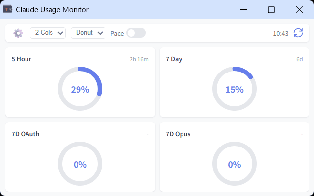

# Claude Usage Monitor

A browser extension that monitors Claude.ai usage limits with visual charts and periodic updates.

  

## Installation

https://chromewebstore.google.com/detail/claude-usage-monitor/jaadjbgpijajmhponmgggflfgmboknge
https://addons.mozilla.org/ja/firefox/addon/claude-usage-monitor/

## Usage

### Initial Setup

1. Click the extension icon to open the monitor window
2. Click the settings icon (⚙️) to open settings
3. Enter your Organization ID
  - See "How to Find Organization ID" section below for instructions
4. Click "Save"

### Monitor Interface

#### View Controls

- **View selector (Donut/Bar)**: Switch between chart display types
- **Column selector (1 Col/2 Cols/4 Cols)**: Change grid column count

#### Pace Indicator

- **Pace toggle**: When enabled, displays expected usage rate (purple) based on time elapsed
- If actual usage exceeds expected usage, it indicates you're consuming credits faster than average

## Troubleshooting

### How to Find Organization ID
1. Log into Claude.ai
2. Go to https://claude.ai/settings/account
3. Find the "Organization ID" field in the Account section
4. Click the copy button next to your Organization ID
5. Paste it into the extension settings

## Disclaimer

This is an unofficial tool. Please use it in accordance with Claude.ai's Terms of Service.
